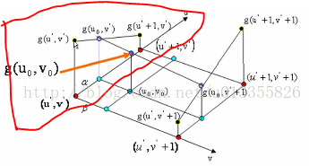
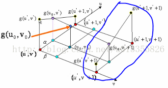

经典插值算法

标签（空格分隔）： 插值

---

## 插值的目的

一般在图像的放大或者缩小的过着中，需要计算新的像素点的值，这些新的点的值如何确定，就需要用到各种插值算法，双线性插值就是一种比较实用的方法。

 [Reference](https://blog.csdn.net/u013355826/article/details/56680521)

## 一维线性插值
已知两个点（x0,y0）,(x1,y1),并且已知x的值求y的值，根据

\begin{equation}
y = \frac{x_1 - x}{x_1 - x_0}y_0 +\frac{x - x_0}{x_1 - x_0}y_1
\end{equation}

令：
\begin{equation}
\alpha =\frac{x-x_0}{x_1-x_0}
\end{equation}
则有：
\begin{equation}
y = (1-\alpha)y_0+\alpha y_1
\end{equation}

## 双线性插值

> 在数学上，双线性插值是有两个变量的插值函数的线性插值扩展，其核心思想是在两个方向分别进行一次线性插值

个人理解，双线性插值就是做了两次一维线性插值。

对于一个点插值点（u0,v0），可以用四个临近的点来确定其灰度值。因为(u0,v0)对应在原始输入图像上不是整数坐标，所以它一定会落在原始的四个像素点中间,假设(u,v)向下取整之后是(u',v')。

则相邻的四个像素点分别是：（u' , v' ）、（u' , v' +1）、（u'+1 , v' ）、（u' +1, v'+1 ）。





[wikipedia 双线性插值](https://zh.wikipedia.org/wiki/%E5%8F%8C%E7%BA%BF%E6%80%A7%E6%8F%92%E5%80%BC)


>如图1所示：在红色平面内，在红色平面内，只有u' 是变量，v' 是常值，连线 g(u' , v' )、 g(u'+1 , v' )，相当于做一次一维线性插值，求出 g(u0, v' )的值。同理，如图3中，在蓝色的平面内我们可以再做一次一维线性插值，求出g(u0, v' +1)的值。同理如图4，在黑色的平面内，我们可以求出(u0, v0)对应的值g(u0, v0)的值。（双线性插值就是分别在 u、v方向上做线性插值）

$\alpha 和 \beta$分别是u,v取整之后的值与原值之差。
即$\alpha = u_0 - u'$ , $\beta = v_0 - v'$
利用公式(3)，可以得到
\begin{equation}
g(u_0,v') = (1-\alpha)g(u',v') + \alpha g(u'+1,v')
\end{equation}

\begin{equation}
g(u_0,v' + 1) = (1-\alpha)g(u',v'+!) + \alpha g(u'+1,v'+1)
\end{equation}

将上述式子带入下式：

\begin{equation}
g(u_0,v_0) = (1-\beta)g(u_0,v') + \beta g(u_0,v'+1)
\end{equation}

得到：

\begin{equation}
g(u_0,v_0) = (1-\alpha)(1-\beta)g(u',v') +\alpha(1-\beta)g(u'+1,v')+\beta(1-\alpha)g(u',v'+1)+\alpha\beta g(u'+1,v'+1)
\end{equation}
测试代码

```cpp
// A Hello World! program in C#.
using System;
namespace HelloWorld
{
    class Hello 
    {
        public double[,] ZoomBilinearInterp_Double(double[,] array_In, double scaleX, double scaleY)
        {
            int originalHeight = array_In.GetLength(0);
            int originalWidth = array_In.GetLength(1);
            int newHeight = (int)(originalHeight * scaleY);
            int newWidth = (int)(originalWidth * scaleX);

            double[,] array_Out = new double[newHeight, newWidth];
            double u = 0, v = 0, x = 0, y = 0;
            int m = 0, n = 0;

            for (int i = 0; i < newHeight; ++i)
            {
                for (int j = 0; j < newWidth; ++j)
                {
                    y = i / scaleY;
                    x = j / scaleX;

                    m = (int)y;
                    n = (int)x;

                    v = y - m;
                    u = x - n;
                    
                    // maybe a better way
                    //SrcX=(dstX+0.5)* (srcWidth/dstWidth) -0.5 
                    //SrcY=(dstY+0.5) * (srcHeight/dstHeight)-0.5，

                    if (m < originalHeight - 1 && n < originalWidth - 1)
                    {
                        array_Out[i, j] = (double)( (1.0 - v) * ( (1.0 - u) * array_In[m, n] + u * array_In[m, n + 1] )
                                                  + v * ( (1.0 - u) * array_In[m + 1, n] + u * array_In[m + 1, n + 1]));
                    }
                    else
                    {
                        array_Out[i, j] = array_In[m, n];
                    }
                }
            }

            return array_Out;
        }

        static void Main() 
        {
            double[,] array_In = {{255 , 255 ,255, 255 ,255, 255 ,255, 255 },
                                { 250, 249 ,255, 248, 249, 255 ,247 ,250 },
                                { 237, 152 ,181 ,143 ,169, 191 ,166 ,238 },
                                { 236, 123 ,124 ,114 ,189, 173 ,148 ,238 },
                                { 236, 127 ,149 ,152 ,219, 161 ,148, 240 },
                                { 234, 130 ,181 ,181 ,220, 169 ,157, 239 },
                                { 243, 177 ,173 ,176 ,193, 171 ,178, 244 },
                                { 254 ,249, 245 ,248 ,247, 245 ,247 ,254}};
            Hello test = new Hello();
            double[,]  arrar_Out = test.ZoomBilinearInterp_Double(array_In,5,5);
            for (int i = 0; i < arrar_Out.GetLength(0); ++i)
            {
                for (int j = 0; j < arrar_Out.GetLength(1); ++j)
                {
                    Console.Write(arrar_Out[i, j]);
                    Console.Write(' ');
                }
                Console.Write('\n');
            }
            // Keep the console window open in debug mode.
            Console.WriteLine("Press any key to exit.");
            Console.ReadKey();
        }
    }
}
```