- 

GCN_Introduction

2019年6月5日

2:38

从CNN到GCN的联系与区别——GCN从入门到精（fang）通（qi）

 **1** **什么是离散卷积？****CNN****中卷积发挥什么作用？** 

了解GCN之前必须对离散卷积（或者说CNN中的卷积）有一个明确的认识： 

如何通俗易懂地解释卷积？这个链接的内容已经讲得很清楚了，

离散卷积本质就是一种加权求和。 

 

如图1所示，CNN中的卷积本质上就是利用一个共享参数的过滤器（kernel），通过计算中心像素点以及相邻像素点的加权和来构成feature map实现空间特征的提取，当然加权系数就是卷积核的权重系数。

 

 那么卷积核的系数如何确定的呢？是随机化初值，然后根据误差函数通过反向传播梯度下降进行迭代优化。这是一个关键点，卷积核的参数通过优化求出才能实现特征提取的作用，**GCN****的理论很大一部分工作就是为了引入可以优化的卷积参数。**

 

**2 GCN****中的****Graph****指什么？为什么要研究****GCN****？**

 CNN是Computer Vision里的大法宝，效果为什么好呢？原因在上面已经分析过了，可以很有效地提取**空间特征**。但是有一点需要注意：CNN处理的图像或者视频数据中像素点（pixel）是排列成成很整齐的矩阵（如图2所示，也就是很多论文中所提到的Euclidean Structure）。

​												图2 图像矩阵示意图（Euclidean Structure）

 

与之相对应，科学研究中还有很多Non Euclidean Structure的数据，如图3所示。社交网络、信息网络中有很多类似的结构。

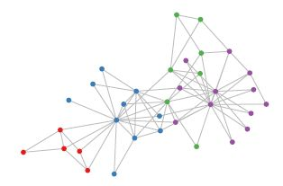

图3 社交网络拓扑示意（Non Euclidean Structure）

实际上，这样的网络结构（Non Euclidean Structure）就是图论中抽象意义上的拓扑图

 

 

 

所以，Graph Convolutional Network中的Graph是指数学（图论）中的用顶点和边建立相应关系的拓扑图。

 

那么为什么要研究GCN？原因有三：

**(1)CNN****无法处理Non Euclidean Structure的数据**，学术上的表达是传统的离散卷积（如问题1中所述）在Non Euclidean Structure的数据上无法保持平移不变性。通俗理解就是在拓扑图中每个顶点的相邻顶点数目都可能不同，那么当然无法用一个同样尺寸的卷积核来进行卷积运算。

(2)由于CNN无法处理Non Euclidean Structure的数据，又希望在这样的数据结构（拓扑图）上有效地**提取空间特征来进行机器学习**，所以GCN成为了研究的重点。

(3)读到这里大家可能会想，自己的研究问题中没有拓扑结构的网络，那是不是根本就不会用到GCN呢？其实不然，广义上来讲任何数据在赋范空间内都可以建立拓扑关联，谱聚类就是应用了这样的思想（[谱聚类（spectral clustering）原理总结](https://link.zhihu.com/?target=https%3A//www.cnblogs.com/pinard/p/6221564.html)）。所以说拓扑连接是一种广义的数据结构，GCN有很大的应用空间。

综上所述，GCN是要为除CV、NLP之外的任务提供一种处理、研究的模型。

 

**3** **提取拓扑图空间特征的两种方式**

 

GCN的本质目的就是用来提**取拓扑图的****空间特征**，那么实现这个目标只有graph convolution这一种途径吗？当然不是，在**vertex domain**(spatial domain)和**spectral domain**实现目标是两种最主流的方式。

 

(1)**vertex domain(spatial domain)**是非常直观的一种方式。顾名思义：提取拓扑图上的空间特征，那么就把**每个顶点相邻的neighbors找出来**。这里面蕴含的科学问题有二：

a.按照什么条件去找中心vertex的neighbors，也就是如何确定receptive field？

b.确定receptive field，按照什么方式处理包含不同数目neighbors的特征？

根据a,b两个问题设计算法，就可以实现目标了。推荐阅读这篇文章[Learning Convolutional Neural Networks for Graphs](https://link.zhihu.com/?target=http%3A//proceedings.mlr.press/v48/niepert16.pdf)（图4是其中一张图片，可以看出大致的思路）。

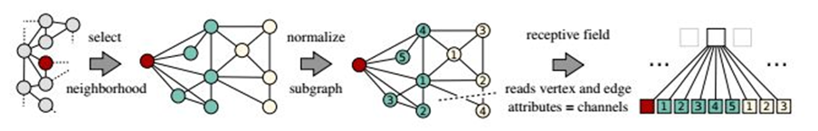

图4 vertex domain提取空间特征示意

这种方法主要的缺点如下：

c.每个顶点提取出来的neighbors不同，使得计算处理必须针对每个顶点

d.提取特征的效果可能没有卷积好

当然，对这个思路喜欢的读者可以继续搜索相关文献，学术的魅力在于百家争鸣嘛！

 

 

(2)**spectral domain****就是GCN的理论基础了。**这种思路就是希望**借助图谱的理论**来实现拓扑图上的卷积操作。从整个研究的时间进程来看：首先研究GSP（graph signal processing）的学者定义了graph上的**Fourier Transformation****（****傅里叶变换****）**，进而定义了graph上的**convolution**，最后与深度学习结合提出了Graph Convolutional Network。

认真读到这里，脑海中应该会浮现出一系列问题：

Q1 什么是Spectral graph theory？

[Spectral graph theory](https://link.zhihu.com/?target=https%3A//en.wikipedia.org/wiki/Spectral_graph_theory)请参考这个，简单的概括就是借助于图的拉普拉斯矩阵的特征值和特征向量来研究图的性质

Q2 GCN为什么要利用**Spectral graph theory**？

这应该是看论文过程中读不懂的核心问题了，要理解这个问题需要大量的数学定义及推导，没有一定的数学功底难以驾驭（我也才疏学浅，很难回答好这个问题）。

所以，先绕过这个问题，来看Spectral graph实现了什么，再进行探究为什么？

 

**4** **什么是拉普拉斯矩阵？为什么GCN要用拉普拉斯矩阵？**

 

Graph Fourier Transformation及Graph Convolution的定义都用到**图的拉普拉斯矩阵**，那么首先来介绍一下拉普拉斯矩阵。

对于图 G=(V, E)，其Laplacian 矩阵的定义为 L-D-A

其中 L是Laplacian 矩阵， 

 D是顶点的度矩阵（对角矩阵），对角线上元素依次为各个顶点的度， 

 A是图的邻接矩阵。

看图5的示例，就能很快知道Laplacian 矩阵的计算方法。

Degree matrix 邻接点的个数, 自由度矩阵。

Adjacency matrix 邻接矩阵。

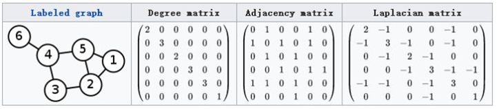

图5 Laplacian 矩阵的计算方法

这里要说明的是：常用的拉普拉斯矩阵实际有三种：

 定义的Laplacian 矩阵更专业的名称叫**Combinatorial Laplacian**

 

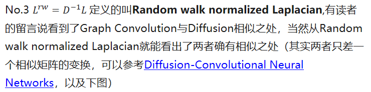

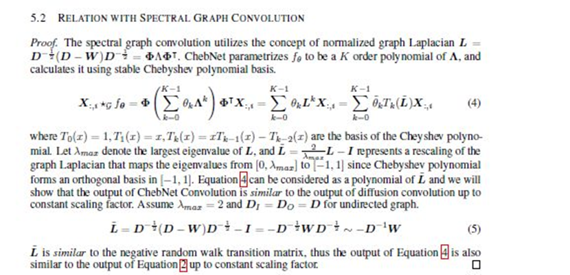

Diffusion Graph Convolution与Spectral Graph Convolution相似性证明

其实维基本科对[Laplacian matrix](https://link.zhihu.com/?target=https%3A//en.wikipedia.org/wiki/Laplacian_matrix)的定义上写得很清楚，国内的一些介绍中只有第一种定义。这让我在最初看文献的过程中感到一些的困惑，特意写下来，帮助大家避免再遇到类似的问题。

 

**为什么GCN要用拉普拉斯矩阵？**

拉普拉斯矩阵矩阵有很多良好的性质，这里写三点我感触到的和GCN有关之处

(1)拉普拉斯矩阵是对称矩阵，可以进行特征分解（谱分解），这就和GCN的spectral domain对应上了

(2)拉普拉斯矩阵只在中心顶点和一阶相连的顶点上（1-hop neighbor）有非0元素，其余之处均为0

（3）通过拉普拉斯算子与拉普拉斯矩阵进行类比（详见第6节）

以上三点是我的一些理解，当然严格意义上，拉普拉斯矩阵应用于GCN有严谨的数学推导与证明。

 

**5** **拉普拉斯矩阵的谱分解（特征分解）**

 

**就是利用拉普拉斯矩阵可以分解的性质，所以有利于特征提取，降维。**

 

GCN的核心基于拉普拉斯矩阵的谱分解，文献中对于这部分内容没有讲解太多，初学者可能会遇到不少误区，所以先了解一下特征分解。

 

**矩阵的谱分解，特征分解，对角化都是同一个概念**（[特征分解_百度百科](https://link.zhihu.com/?target=https%3A//baike.baidu.com/item/%E7%89%B9%E5%BE%81%E5%88%86%E8%A7%A3/12522621%3Ffr%3Daladdin)）。

 

**不是所有的矩阵都可以特征分解，其充要条件为n阶方阵存在n个**[线性无关](https://link.zhihu.com/?target=https%3A//www.baidu.com/s%3Fwd%3D%E7%BA%BF%E6%80%A7%E6%97%A0%E5%85%B3%26tn%3D44039180_cpr%26fenlei%3Dmv6quAkxTZn0IZRqIHckPjm4nH00T1d9mW64Phf3mhD1ujubn1cz0ZwV5Hcvrjm3rH6sPfKWUMw85HfYnjn4nH6sgvPsT6KdThsqpZwYTjCEQLGCpyw9Uz4Bmy-bIi4WUvYETgN-TLwGUv3EnHT3PjD4njnsP1RdPWfkP1mY)的[特征向量](https://link.zhihu.com/?target=https%3A//www.baidu.com/s%3Fwd%3D%E7%89%B9%E5%BE%81%E5%90%91%E9%87%8F%26tn%3D44039180_cpr%26fenlei%3Dmv6quAkxTZn0IZRqIHckPjm4nH00T1d9mW64Phf3mhD1ujubn1cz0ZwV5Hcvrjm3rH6sPfKWUMw85HfYnjn4nH6sgvPsT6KdThsqpZwYTjCEQLGCpyw9Uz4Bmy-bIi4WUvYETgN-TLwGUv3EnHT3PjD4njnsP1RdPWfkP1mY)。

但是拉普拉斯矩阵是**半正定对称矩阵**（半正定矩阵本身就是对称矩阵，[半正定矩阵_百度百科](https://link.zhihu.com/?target=https%3A//baike.baidu.com/item/%E5%8D%8A%E6%AD%A3%E5%AE%9A%E7%9F%A9%E9%98%B5/2152711%3Ffr%3Daladdin)，此处这样写为了和下面的性质对应，避免混淆），有如下三个性质：

·         **对称矩阵一定n个线性无关的特征向量**

·         **半正定矩阵的特征值一定非负**

·         **对阵矩阵的特征向量相互正交，即所有特征向量构成的矩阵为正交矩阵。**

**由上可以知道拉普拉斯矩阵一定可以****谱分解****，且分解后有特殊的形式。**

对于拉普拉斯矩阵其谱分解为：

其中 

 ，是列向量为单位特征向量的矩阵，也就说 

 是列向量。

 是n个特征值构成的对角阵。

由于 

 是正交矩阵，即 

 

**所以特征分解又可以写成：**

 

 

文献中都是最后导出的这个公式，但大家不要误解，**特征分解最右边的是特征矩阵的逆，只是拉普拉斯矩阵的性质才可以写成特征矩阵的转置。**

 

 

其实从上可以看出：整个推导用到了很多数学的性质，在这里写得详细一些，避免大家形成错误的理解。

 

 

**6** **如何从传统的傅里叶变换、卷积类比到Graph上的傅里叶变换及卷积？**

 

把**传统的傅里叶变换**以及卷积迁移到**Graph**上来，核心工作其实就是把**拉普拉斯算子的特征函数 ，** 变为Graph对应的拉**普拉斯矩阵的特征向量**。

(1)推广傅里叶变换

想亲自躬行的读者可以阅读[The Emerging Field of Signal Processing on Graphs: Extending High-Dimensional Data Analysis to Networks and Other Irregular Domains](https://link.zhihu.com/?target=https%3A//arxiv.org/abs/1211.0053)这篇论文，下面是我的理解与提炼：

 

(a)Graph上的傅里叶变换

传统的傅里叶变换定义为：

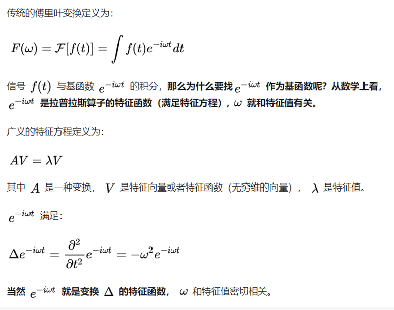

那么，可以联想了，处理Graph问题的时候，用到拉普拉斯矩阵（拉普拉斯矩阵就是离散拉普拉斯算子，想了解更多可以参考[Discrete Laplace operator](https://link.zhihu.com/?target=https%3A//en.wikipedia.org/wiki/Discrete_Laplace_operator)），自然就去找拉普拉斯矩阵的特征向量了。

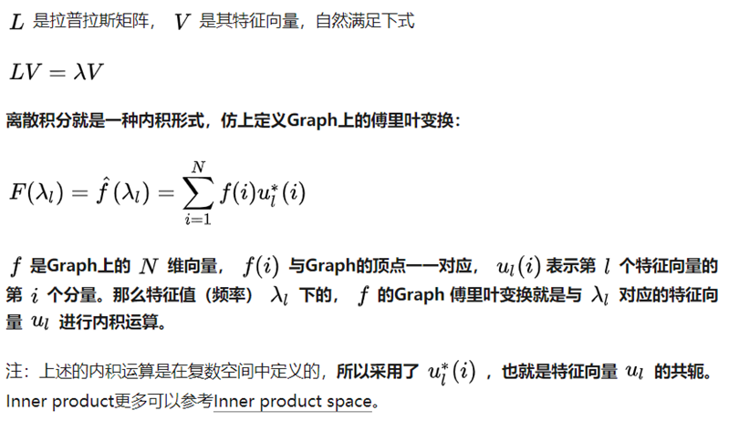

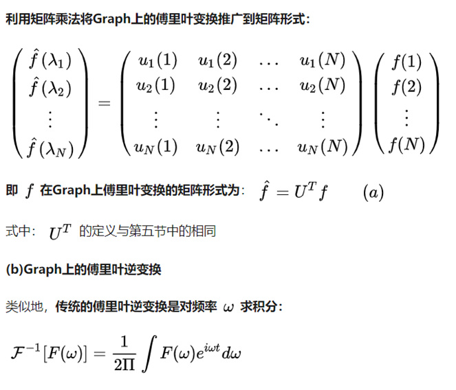

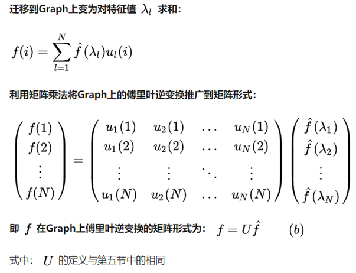

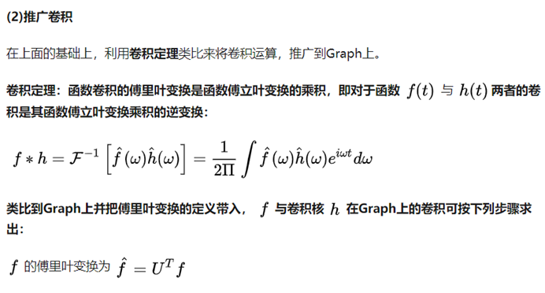

**7** **为什么拉普拉斯矩阵的特征向量可以作为傅里叶变换的基？特征值表示频率？**

 

(1)为什么拉普拉斯矩阵的特征向量可以作为傅里叶变换的基？

傅里叶变换一个本质理解就是：把任意一个函数表示成了若干个正交函数（由sin,cos 构成）的线性组合。

图6 傅里叶逆变换图示

通过第六节中(b)式也能看出，graph傅里叶变换也把graph上定义的任意向量 

 ，表示成了拉普拉斯矩阵特征向量的线性组合，即：

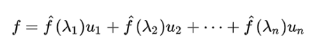

**(2)****怎么理解拉普拉斯矩阵的特征值表示频率？**

其实图像压缩就是这个原理，把像素矩阵特征分解后，把小的特征值（低频部分）全部变成0，PCA降维也是同样的，把协方差矩阵特征分解后，按从大到小取出前K个特征值对应的特征向量作为新的“坐标轴”。

Graph Convolution的理论告一段落了，下面开始Graph Convolution Network

 

 

 

8 Deep Learning中的Graph Convolution

Deep learning 中的Graph Convolution直接看上去会和第6节推导出的图卷积公式有很大的不同，但是万变不离其宗，(1)式是推导的本源。

第1节的内容已经解释得很清楚：Deep learning 中的Convolution就是要设计含有trainable共享参数的kernel，从(1)式看很直观：graph convolution中的卷积参数就是 

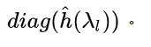

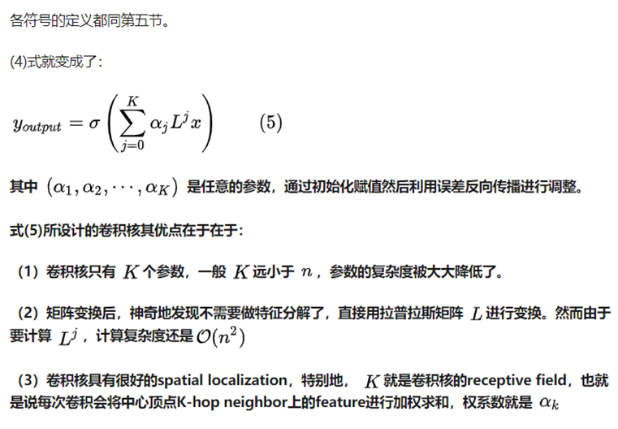

更直观地看， *K*=1就是对每个顶点上一阶neighbor的feature进行加权求和，如下图所示：

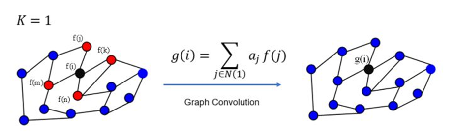

图7 k=1 的graph convolution示意

同理，*K*=2的情形如下图所示：

图8 k=2 的graph convolution示意

注：上图只是以一个顶点作为实例，GCN每一次卷积对所有的顶点都完成了图示的操作。

 

 

·         **利用Chebyshev多项式递归计算卷积核**

 

 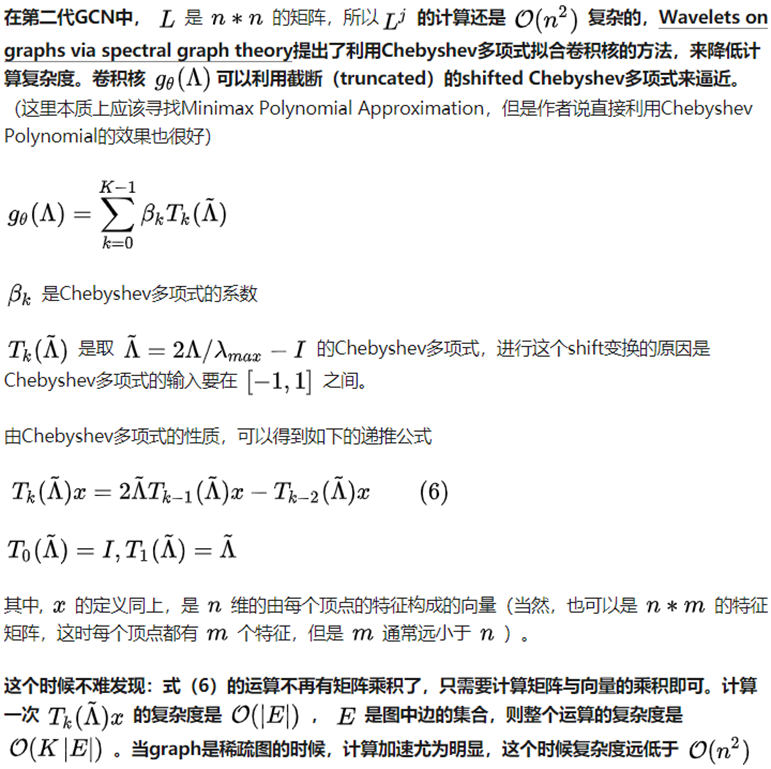

**在GCN中的Local Connectivity和Parameter Sharing**

 

 

CNN中有两大核心思想：网络局部连接，卷积核参数共享。这两点内容的详细理解可以看我的这个回答。

[如何理解卷积神经网络中的权值共享？www.zhihu.com](https://www.zhihu.com/question/47158818/answer/670431317)

那么我们不禁会联想：这两点在GCN中是怎样的呢？以下图的graph结构为例来探究一下

graph结构示意

·         GCN中的Local Connectivity

(a)如果利用第一代GCN，根据式（3）卷积核即为

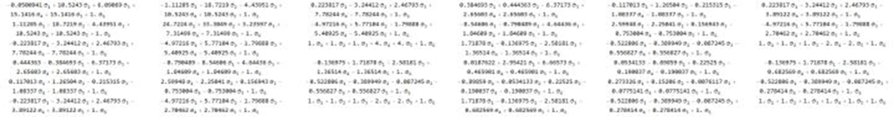

第一代卷积核示意（需要放大观看）

这个时候，**可以发现这个卷积核没有local的性质**，因为所有位置上都有非0元素。以第一个顶点为例，如果考虑一阶local关系的话，那么卷积核中第一行应该只有[1,1],[1,2],[1,5]这三个位置的元素非0。换句话说，**这是一个global全连接的卷积核。**

(b)如果是第二代GCN，根据式（5）当 

 卷积核即为

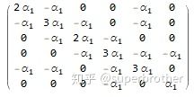

第二代卷积核示意（K=1）

当 

 卷积核即为

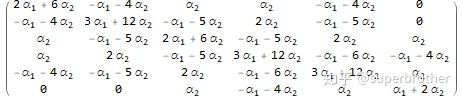

第二代卷积核示意（K=2）

看一下图的邻接结构，卷积核的非0元素都在localize的位置上。

·         GCN中的Parameter Sharing

 

来自 <https://www.zhihu.com/question/54504471> 

